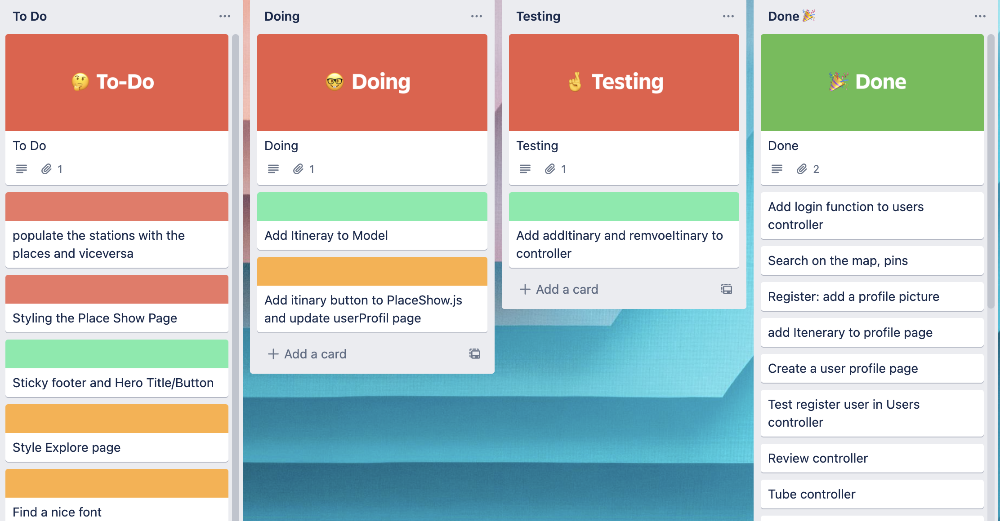
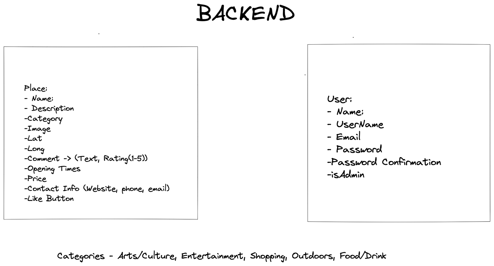
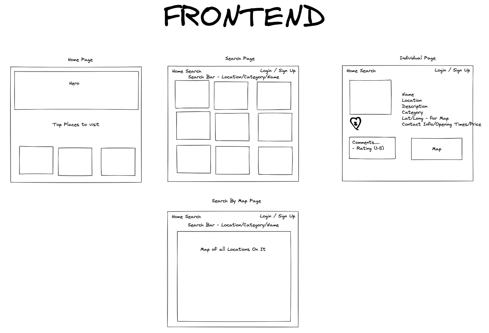

# GA project 3

Our task was to create a full stack app, using a Mongo database in the backend, and React for the frontend.

## Timeframe

7 days

## Technologies Used

- JavaScript
- React
- Bulma
- Axios
- Node.js
- MongoDB
- Netlify
- Heroku
- Webpack
- SCSS

## Our Idea

This project was created with [Edward Foulds](https://github.com/FouldsEJ) and [Tatiana Guzun](https://github.com/TatianaRG).

We created an app for destinations in London for anyone that wants to find new places to explore. Users can like, rate and comment on places, so you can see what it's like before you go.

## Planning

To keep on top of the work as a group we used Trello. We colour coded our tasks to show who was implementing each task. We first completed all the tasks in the back end and moved onto the front end as a team. We used Edwards Github to store the project and at the end of the day we would merge conflicts together to make sure there were no issues.



Our plan for the back end API was a place and user model. We then added the stations model later on in our planning.



For the front end, we wanted a home page that included our top rated places to visit, and then a search page, individual place page and a map page. We later added the map to the search page.



The main tasks I was responsible for were the search page, adding and removing user likes and itinerary, the itinerary page, the place cards, and making sure certain parts of the page were only visible to those logged in/admin.

## Itinerary

### Back end

The itinerary feature is on every place page. Each user can add or remove a place from their itinerary. Once added, it will show up on your profile page under a list of places you wish to go.

The itinerary is located in the **places model** in the back end -

```javascript
itinerary: [{ type: mongoose.Schema.ObjectId, ref: 'User' }];
```

When you add a place to your itinerary you are actually adding your user ID to the itinerary array in the place model.

Then to view all of the places on your profile page you find the places that include the userID in their itinerary -

```javascript
const places = await Place.find({ itinerary: userId });
```

### Front end

To make the button change from "Add to Itinerary" to "Remove from Itinerary" We started with setting a state for the itinerary with it starting as True.

```javascript
const [itineraryBut, setItineraryBut] = React.useState(true);
```

When we get to our add or remove function, we set the state to **!itineraryBut**

```javascript
async function handleAddOrRemoveItinerary() {
  setItineraryBut(!itineraryBut);
  if (singlePlace.itenerary.includes(getLoggedInUserId())) {
    const data = await removeFromItinerary(id);
    setSinglePlace(data);
  } else {
    const data = await addToItinerary(id);
    setSinglePlace(data);
  }
}
```

If the user ID is included in the place itinerary, we will remove it. If it is not, we add it to the itinerary.

Then on the button in the return, we add a ternary statement.

```javascript
{
  itineraryBut ? 'Remove from Itinerary' : 'Add to Itinerary';
}
```

## Reviews

### Back end

For the reviews, we started with the review schema which included a comment, rating, and created by, so we can later gather the user's username and image to display in the comments section.

```javascript
const reviewSchema = new mongoose.Schema(
  {
    comment: { type: String, required: true, maxlength: 300 },
    rating: { type: Number, required: true, min: 1, max: 5 },
    createdBy: { type: mongoose.Schema.ObjectId, ref: 'User', required: true }
  },
  { timestamps: true }
);
```

We then added this schema into the places model -

```javascript
reviews: [reviewSchema];
```

Then we added a create, delete and update function to our controllers. Take the delete controller for example.

We are expecting a place ID and a review ID in the params.

```javascript
const { id, reviewId } = req.params;
const place = await Place.findById(id);
const review = place.reviews.id(reviewId);
```

We then create 404 messages if there is no review or no place

```javascript
if (!review) {
  return res.status(404).send({ message: 'Review not found' });
}
```

If we do have both of these things we remove the review and save the place.

### Front end

You can then see how the place and review ID are added to the params in the front end function.

```javascript
const options = {
  method: 'DELETE',
  url: `/api/places/${placeId}/reviews/${reviewId}`,
  headers: {
    authorization: `Bearer ${window.sessionStorage.getItem('token')}`
  }
};
```

We wanted the delete button to only show for reviews that the user has created. We did this by checking if the userID is the same as the createdby ID in the review. (Admin can also delete any comments)

```javascript
{
  (getLoggedInUserId() === review.createdBy || isAdmin()) && (
    <button onClick={() => handleDeleteReview(review._id)}>
      Delete Review
    </button>
  );
}
```

## Wins

1.  I think the search bar on the explore page was done really well. It is case insensitive and works with the category searches too. I think it makes the search bar slick and easy to use.

This was all done in the back end by creating a request that takes the search text, category and station.

```javascript
const places = await Place.find({
  name: new RegExp(textSearch, 'i'),
  category: { $regex: categorySearch },
  stationName: { $regex: stationSearch }
});
```

2.  We did well making features like the logout button and post a review section only visible to those logged in.

3.  We worked well as a team and kept in constant communication using trello and skype, which made working on this project run smoothly.

## Bugs

No known bugs.

## Future Features

I think we could have done more with the profile page and itinerary. If we had more time we could add the map to the profile page which included all of the places in your itinerary. We could have also added the places to a timeline so the user can plan out their day.
